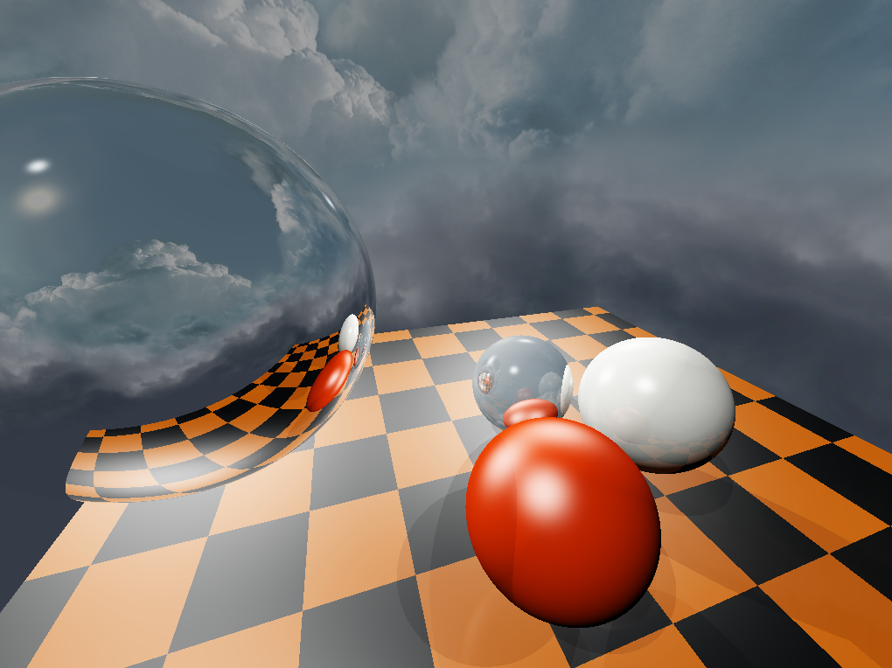

# tinyraytracer-openglcompute

This toy ray tracer is based on [tinyraytracer](https://github.com/ssloy/tinyraytracer).

Just like the original version, it supports reflections and refractions but it is completely implemented using OpenGL compute shaders.

## Some results




## How it works

The original version of tinyraytracer is excellent and extremely easy to understand. However, being completely based on the CPU,
it is quite slow.<br> On an `i7 7700 HQ` it took `2717 ms` to render a single frame (with multi-threading disabled). By using more
threads the render time can be reduced by a factor of 8 (on this particular processor but I haven't tested it) which means almost 3 frames
per second.

The GPU implementation, on the other hand, can reach up until 50 fps on a `GTX 1050`. <br>
The greatest difficulty faced while porting is the lack of recursion in GLSL.<br>
In the original algorithm, when a ray hits a surface it is split in two more rays: the *reflected* ray and the *refracted* ray which will recursively
undergo the same process if they hit another surface (until a certain threshold is reached).
By doing so, the color of a surface is decided when a ray hits it using its material and the colors transported by the reflected and refracted rays. This
is a recursive algorithm by nature.<br>
To simulate recursion in GLSL, I used an approach that takes inspiration from the heap data structure. A heap is basically a binary tree and many implementations
flatten the whole tree in an array. If a node is stored at index `i` its left child is at index `2 * i` and its right child is at index `2 * i + 1` (root is at index `1`).

The aforementioned algorithm forms a tree which is explored with a post order traversal:

``` glsl
vec3 castRay(origin, direction) {

    vec3 hitpoint;          // out parameter: where the surface is hit
    vec3 normal;            // out parameter: the normal of the surface in hitpoint
    Material material;      // out parameter: the material of the surface

    bool hit = checkIntersection(origin, direction, normal, material);

    // no intersections return bg color
    if (!hit) return vec3(0.0);

    vec3 reflected = reflect(direction, normal);
    vec3 refracted = refract(direction, normal, material.refractiveFactor);

    // recursive calls
    vec3 reflectColor = castRay(hitpoint, reflected);
    vec3 refractColor = castRay(hitpoint, refracted);

    // not as easy but similar ...
    vec3 outColor = material.diffuse + reflectColor + refractColor; 

    return outColor;
}
```

Therefore, it is possible to implement this algorithm iteratively leveraging its implicit tree structure. To do so, it is necessary to
use two additional data structures: a stack `stack` and an array `data`. Identifying each ray with and id `i`, the algorithm elaborates
one ray at a time using the stack and stores the color sampled by each ray in `data[i]`. By doing so, the ray with index `i` can
retrieve the colors sampled by its children using `data[2 * i]` and `data[2 * i + 1]`.

This is still a naive approach and I'm sure there must be a way to parallelize the algorithm even more but for the time being the results
are pretty nice!
